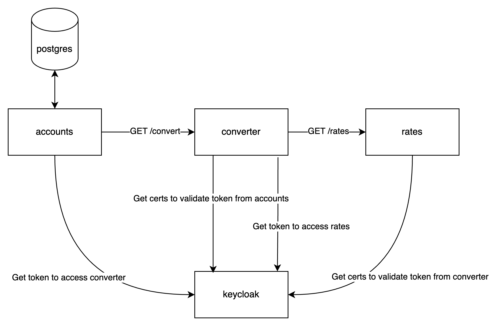

# Задание

Необходимо превратить свой maven/gradle проект в многомодульный. Первым модулем сделать `converter` из ДЗ#3

Доработать workflow сборки, чтобы каждый модуль собирался в свой докер образ

Вторым модулем разработать новый сервис `accounts`


- Все данные требуется хранить в **PostgreSQL**. Схему данных требуется разработать самостоятельно
  и автоматически создавать из кода приложения при запуске.
- Все суммы нужно передавать и хранить с точностью **до 2 знаков после запятой**. Способ округления - half even.
- Приложение должно слушать порт 8080.
- Счета могут быть в разных валютах. Всего есть 5 валют: **USD, EUR, GBP, RUB, CYN**.

Требуется разработать следующие REST-эндпоинты.

## POST /customers

Создание счета

### Входные параметры

| Параметр  | Тип данных    | Обязательный | Описание                          |
|-----------|---------------|--------------|-----------------------------------|
| firstName | string        | +            | Имя клиента                       |
| lastName  | string        | +            | Фамилия клиента                   |
| birthDay  | string($date) | +            | Дата рождения, формат: YYYY-MM-DD |

`POST /customers`

```json
{
  "firstName": "Петр",
  "lastName": "Иванов",
  "birthDay": "1923-12-30"
}
```

### Выходные параметры

| Параметр   | Тип данных | Обязательный | Описание    |
|------------|------------|--------------|-------------|
| customerId | integer    | +            | Номер счета |

`HTTP 200 OK`

```json
{
  "customerId": 1
}
```

### Логика метода

1. Проверить наличие обязательных параметров в запросе и формат значений.
2. Проверить, что birthDay < текущей даты. Если нет - вернуть ошибку.
3. Проверить возраст клиента, сравнив год между birthDay и текущей датой. Если полученный возраст
   ВНЕ диапазона от 14 до 120, то вернуть ошибку.
4. Сохранить в базу данных.
5. При успехе, вернуть в ответе HTTP 200 OK и id созданного клиента.

* В случае невалидного запроса вернуть HTTP 400
* В случае ошибок во время работы метода, вернуть HTTP 500.

## GET /customers/{customerId}/balance?currency={currency}

Получение баланса по всем счетам клиента в определенной валюте

### Входные параметры

| Параметр   | Тип данных | Обязательный | Описание   |
|------------|------------|--------------|------------|
| customerId | integer    | +            | Id клиента |
| currency   | string     | +            | Валюта     |

`GET /customers/1/balance?currency=RUB`

### Выходные параметры

| Параметр | Тип данных | Обязательный | Описание |
|----------|------------|--------------|----------|
| balance  | integer    | +            | Сумма    |
| currency | string     | +            | Валюта   |

`HTTP 200 OK`

```json
{
  "balance": 243243.43,
  "currency": "RUB"
}
```

### Логика метода

1. Проверить наличие обязательных параметров в запросе и формат значений.
2. Проверить, что клиент существует. Если нет - вернуть ошибку.
3. Получить все счета клиента, перевести все балансы в заданную валюту и посчитать сумму.   
Для конвертации валюты вызвать `GET /convert` сервиса `converter`
4. При успехе, вернуть в ответе HTTP 200 OK и сумму балансов.

* В случае невалидного запроса вернуть HTTP 400
* В случае ошибок во время работы метода, вернуть HTTP 500.

## POST /accounts

Создание счета

### Входные параметры

| Параметр   | Тип данных | Обязательный | Описание     |
|------------|------------|--------------|--------------|
| customerId | number     | +            | Id клиента   |
| currency   | string     | +            | Валюта счета |

`POST /accounts`

```json
{
  "customerId": 1,
  "currency": "RUB"
}
```

### Выходные параметры

| Параметр      | Тип данных | Обязательный | Описание    |
|---------------|------------|--------------|-------------|
| accountNumber | integer    | +            | Номер счета |

`HTTP 200 OK`

```json
{
  "accountNumber": 2000002507
}
```

### Логика метода

1. Проверить наличие обязательных параметров в запросе и формат значений.
2. Если currency из запроса != RUB, USD, GBP, EUR, CYN то вернуть ошибку.
3. Если счет в данной валюте у клиента уже есть, вернуть ошибку
4. Сохранить в базу данных.
5. При успехе, вернуть в ответе HTTP 200 OK и созданный accountNumber.

* В случае невалидного запроса вернуть HTTP 400
* В случае ошибок во время работы метода, вернуть HTTP 500.

## GET /accounts/{accountNumber}

Получение баланса счета

### Входные параметры

| Параметр      | Тип данных | Обязательный | Описание    |
|---------------|------------|--------------|-------------|
| accountNumber | integer    | +            | Номер счета |

`GET /account/2000002507`

### Выходные параметры

| Параметр | Тип данных      | Обязательный | Описание |
|----------|-----------------|--------------|----------|
| amount   | number($double) | +            | Баланс   |
| currency | string          | +            | Валюта   |

`HTTP 200 OK`

```json
{
  "amount": 10000.95,
  "currency": "RUB"
}
```

### Логика работы

1. Проверить наличие обязательных параметров в запросе.
2. Найти в базе данных счет по переданному accountNumber.
    1. Если счет не найден, то вернуть ошибку.
    2. Если найден - вернуть в ответе в параметрах amount и currency значения из базы данных.
3. В случае успеха вернуть ответ HTTP 200 OK.

* В случае невалидного запроса вернуть HTTP 400.
* Если счета не существует, то вернуть HTTP 400.
* В случае ошибок во время работы метода, вернуть HTTP 500.

## POST /accounts/{accountNumber}/top-up

Пополнение счета

### Входные параметры

| Параметр | Тип данных      | Обязательный | Описание         |
|----------|-----------------|--------------|------------------|
| amount   | number($double) | +            | Сумма пополнения |

`POST /accounts/{accountNumber}/top-up`

```json
{
  "amount": 12.05
}
```

### Выходные параметры

Отсутствуют.

`HTTP 200 OK`

```json
{}
```

### Логика работы

1. Проверить наличие обязательных параметров в запросе и формат значений.
2. Найти в таблице account запись с accountNumber из запроса. Если не найдена - вернуть ошибку.
3. Проверить, что amount в запросе > 0. Если нет, вернуть ошибку.
4. Обновить поле account.amount = account.amount + amount из запроса и вернуть в ответе 200 OK.

* В случае невалидного запроса, вернуть HTTP 400.
* Если счета не существует, то вернуть HTTP 400.
* В случае ошибок во время работы метода, вернуть HTTP 500.

## POST /transfers

Выполнение денежного перевода (с возможной конвертацией)

### Входные параметры

| Параметр               | Тип данных      | Обязательный | Описание                                  |
|------------------------|-----------------|--------------|-------------------------------------------|
| receiverAccount        | integer         | +            | Номер счета получателя                    |
| senderAccount          | integer         | +            | Номер счета отправителя                   |
| amountInSenderCurrency | number($double) | +            | Сумма перевода в валюте счета отправителя |

`POST /transfers`

```json
{
  "receiverAccount": 2000002507,
  "senderAccount": 7346006129,
  "amountInSenderCurrency": 10000.95
}
```

### Выходные параметры

Отсутствуют.

`HTTP 200 OK`

```json
{}
```

### Логика работы

1. Проверить данные в запросе:
    1. Проверить наличие обязательных параметров в запросе и формат значений.
    2. Проверить, что amountInSenderCurrency в запросе > 0. Если нет, вернуть ошибку.
2. Найти в таблице account записи по senderAccount и receiverAccount. Если выборка пустая, вернуть
   ошибку.
3. Проверить, что баланс отправителя >= amountInSenderCurrency. Если нет, вернуть ошибку.
4. Проверить валюту счета отправителя и счета получателя.
    1. Если валюты равны, то нужно обновить балансы на amountInSenderCurrency.
    2. Если валюты НЕ равны, то надо конвертировать
       Для конвертации валюты вызвать `GET /convert` сервиса `converter`
    3. Обновить балансы:

    * Вычесть отправленную сумму со счета отправителя.
    * Добавить к балансу счета получателя сумму транзакции с учетом текущего курса.
5. В случае успеха вернуть ответ HTTP 200 OK.

* В случае невалидного запроса вернуть HTTP 400.
* Если какого-либо счета не существует, то вернуть HTTP 400.
* В случае ошибок во время работы метода, вернуть HTTP 500.

# Авторизация

В сервис `rates` была добавлена авторизация. Необходимо научить `converter` ее использовать 

Вам необходимо добавить авторизацию в сервис `converter`. И научить `accounts` ее использовать

Сервис `accounts` оставить без авторизации

Для получения токена использовать `POST ${keycloak_url}/realms/${realm}/protocol/openid-connect/token`

Для проверки пришедшего токена `${keycloak_url}/realms/${realm}/protocol/openid-connect/certs`

Для авторизации используется **client credentials flow**. Все данные будут переданы через переменные окружения
# Тестирование

## таймауты

Контейнеров становится много, окружения большое, а github runner маленький. Поэтому приложения могут работать медленно. Ставьте таймауты у WebClient/RestTemplate в 5-10 секунд 

## Переменные окружения

Ваши приложения должны работать со следующими переменными окружения

Accounts:
* **DB_HOST** - хост БД
* **DB_PORT** - порт БД
* **DB_NAME** - название БД
* **DB_USER** - пользователь БД
* **DB_PASSWORD** - пароль для подключения к БД
* **CONVERTER_URL** - адрес конвертера вида http://smth:1234
* **KEYCLOAK_URL** - адрес киклоки вида http://smth:1234
* **KEYCLOAK_REALM** - realm, в котором живет клиент
* **CLIENT_ID** - client-id
* **CLIENT_SECRET** - client-secret

Converter:
* **RATES_URL** - адрес сервиса курсов валют вида http://smth:1234
* **KEYCLOAK_URL** - адрес киклоки вида http://smth:1234
* **KEYCLOAK_REALM** - realm, в котором живет клиент
* **CLIENT_ID** - client-id
* **CLIENT_SECRET** - client-secret

При установке хелм чарта переменные окружения будут передаваться через переменные чарта.
Для этого нужно добавить в свои чарты поддержку переменной extraEnv

```yml
extraEnv:
  - name: ENV_NAME
    value: some-value
```

Чарт должен уметь работать с переменной-массивом и все параметры передавать в переменные окружения пода

В свой воркфлоу сборки добавить новую джобу

```yaml
jobs:
  autotest:
    needs: $build_job_name # имя вашей основной джобы сборки
    uses: central-university-dev/hse-ab-cicd-hw/.github/workflows/autotests-hw4.yml@main
    with:
      chart-path: ./rates # путь к чарту из второй дз
      converter-image-name: foo/bar-converter # имя образа вашего приложения
      accounts-image-name: foo/bar-accounts # имя образа вашего приложения
      image-tag: $branch_name-$commit_hash # таг образа, который собран в рамках данного ПРа
```

# Схема системы




# Материалы
https://www.baeldung.com/spring-webclient-oauth2
https://habr.com/ru/companies/reksoft/articles/552346
